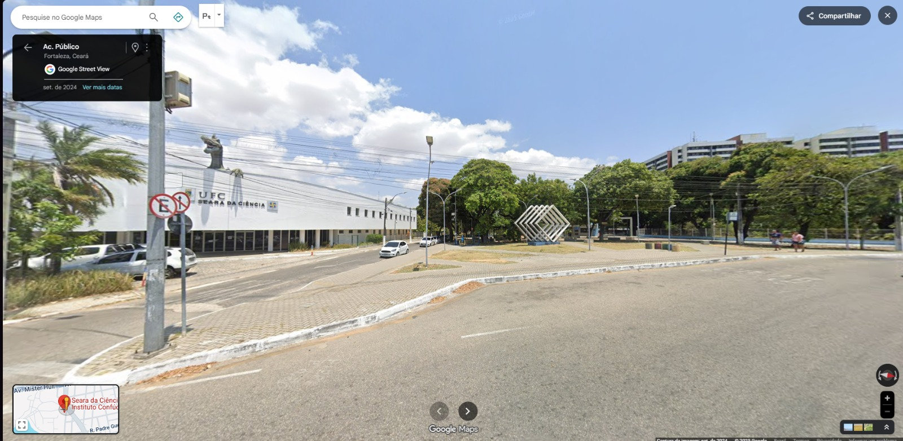
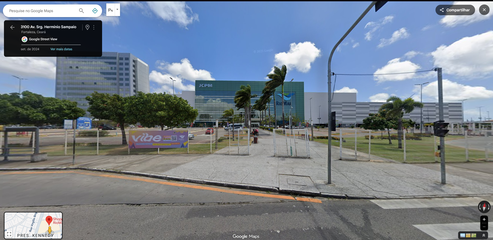
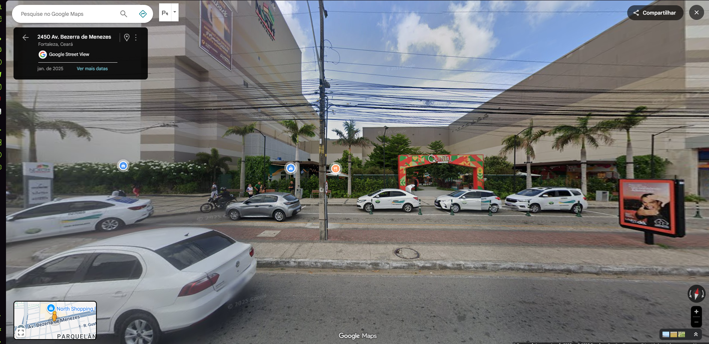

# Manos: a brigaria come solta
MacacoProduções ©
 

# Visão  Geral 🖼️
Nesta Seção será apresentado  o titulo do jogo, o estilo do jogo, publico alvo e a plataforma que eu quero lançar o jogo, esté topico  apresentará ao  usuário  o que será a proposta

Um jogo multijogador , co-op local, **Beat´em up 2D** no estilo TMNT, com foco em **combos rapidos,  jogabilidade divertida e classica e tendo muitos elementos comicos** para aumentar o entreterimento  da rapaziada 

**Plataforma Alvo:** PC(Windows)

**Público Alvo:** jovens, adultos que gostam de um gamer retro, galera que gosta de jogos engraçados e jogos multiplayer local

# Game design 🎮
Aqui nesta seção terá mais detalhes tecnicos do jogo como,  a historia, detalhes dos personagens , cenarios, mecanicas entre outros detalhes.

A ideia de game, a ambientação, foram inspiradas nos clássicos BEAT em up's que eu joguei , tmnt , final fight, Double dragon , metamorphic forces, porém com um ar mais colorido e engraçado e se passando pelos  bairros de fortaleza onde eu cresci.

## Préfacio:
Antes do caos tomar conta da cidade, havia um rapaz: o Sr. Pepas.
Empresário visionário e inventor, ele dedicava sua fortuna à tecnologia. Para muitos, era apenas um gênio excêntrico com dinheiro demais e tempo de sobra. Para poucos, um estrategista silencioso — alguém que via o mundo como um grande tabuleiro e acreditava que o bem também precisava ser planejado.

Foi em um evento da alta sociedade que ele conheceu Michelle — uma mulher carismática, inteligente e movida, ao que parecia, pelos mesmos ideais.

Juntos, fundaram um projeto voltado à “evolução humana”, com o objetivo de restaurar a segurança e o equilíbrio nas cidades, tornando Fortaleza o modelo de um novo mundo.
Pepas acreditava estar ajudando a construir um futuro melhor. Mas, sem perceber, estava dando vida a algo muito mais sombrio.
Encantado por Michelle, ele logo se viu cego de amor. Descobriu que ela dominava tanto as artes da luta quanto da inteligência — e isso só o fascinava mais.

Como prova de afeto, Michelle lhe entregou um presente guardado em uma caixa de metal negro: Dr. Guswinn, um ser de força inumana, outrora um herói caído, capturado e mantido como cobaia.
Mas com o tempo, Michelle revelou suas verdadeiras intenções — transformar o mundo em um “parque de diversões do caos”, onde apenas os mais fortes sobreviveriam.

Quando Pepas tentou detê-la, era tarde demais.
Ela já havia usado seus próprios recursos e tecnologias para criar um exército de mutantes, máquinas e mercenários.
Big Boss, como passou a se chamar, via Pepas como o parceiro perfeito em seu reinado. Mas ao recusar compactuar com a loucura dela, foi traído — teve sua empresa destruída, seu nome manchado e sua vida por um fio.
Mas Pepas sobreviveu.

E no silêncio das ruínas, iniciou seu plano de urgência.
Usando o que restou de seus laboratórios secretos, ele libertou Dr. Guswinn, prometendo ajudá-lo a se vingar da Big Boss, que o havia traído e transformado em experimento.

Para completar o time, Pepas ativou um projeto experimental chamado Diego — um jovem dotado da Toon Force, o poder de materializar a própria imaginação, tornando-o imprevisível e incrivelmente poderoso.
Por fim, ele procurou dois garotos que sempre o inspiraram — Toin e Jonnhy, dois manos de Fortaleza conhecidos por sua coragem, senso de humor e lealdade.

Usando sua tecnologia, Pepas implantou chips de habilidades em ambos, concedendo-lhes poderes únicos.

Pepas sabia que não bastavam armas ou dinheiro para enfrentar o caos — era preciso coragem, determinação e… a manice.

Agora, com seus aliados reunidos, o Sr. Pepas observa das sombras enquanto Big Boss transforma Fortaleza em seu império de loucura.
Ele sabe que esta não será uma guerra comum.

Mas quando o caos toma conta da cidade…
só os manos podem devolver a ordem —
do jeito deles.

## História/Enredo: 
Fortaleza nunca foi uma cidade tranquila — mas o que está acontecendo agora vai além de qualquer bagunça que seus moradores já viram.
Nos últimos meses, bairros inteiros foram tomados por gangues mascaradas, figuras bizarras e até criaturas que desafiam a lógica. O caos se espalha como um vírus, e ninguém entende de onde vem tanta loucura.

Por trás de tudo isso está Big Boss — outrora conhecida como Michelle — a mente brilhante que perdeu o juízo e agora comanda uma organização secreta que mistura tecnologia, manipulação genética e pura insanidade. Seu objetivo é transformar Fortaleza em seu próprio “parque de diversões do caos”.

Enquanto isso, Sr. Pepas ativa o plano que preparou desde o dia em que foi traído. E, para colocá-lo em ação, confia sua esperança aos que menos esperavam por isso — Toin e Jonnhy, dois manos de Fortaleza que cresceram entre risadas, treinos, brigas de esquina e sonhos de um futuro melhor.

Quando percebem que amigos, colegas de escola e até lugares da infância estão sendo dominados pelos capangas da Big Boss, os manos decidem reagir. O que começa como uma simples tentativa de ajudar o bairro logo se transforma em uma jornada épica.

Munidos dos chips de habilidades criados por Pepas, Toin e Jonnhy ganham reflexos aprimorados, força e instintos de combate que beiram o sobrenatural. E não estão sozinhos: Diego, o garoto da Toon Force, se junta à equipe com sua energia caótica e criatividade ilimitada — capaz de invocar desde um martelo gigante até um taco de beisebol só com a imaginação.

Ao lado deles, Dr. Guswinn, o colosso libertado, luta para redimir seus erros do passado e acertar as contas com a mulher que o traiu.
Unidos pela liderança de Toin (encarregado pelo Sr. Pepas), o grupo parte para enfrentar o Big Boss, que controla os principais bairros da cidade.

Cada zona de Fortaleza se torna uma arena de combate:

•	Na Escola Dona Creusa, o empresário corrupto Richard Alburquerco 

•	No Centro, o arruaceiro bombado Bomb Jr. lidera uma gangue de motoqueiros que domina as ruas.

•	Na Lagoa do Urubu, o romântico fracassado HeartBrake comanda um exército de clones apaixonados, espalhando caos e ciúmes por onde passa.

De esquina em esquina, os manos descobrem que a cidade está cheia de segredos — e que cada vilão é uma peça no grande jogo da Big Boss. Mas com cada vitória, o time ganha aliados, desbloqueia novas habilidades e se aproxima da fortaleza principal da vilã: a Torre do Caos, construída sobre os escombros da antiga empresa de Pepas.

No clímax da jornada, Toin, Jonnhy, Diego e Guswinn enfrentam ondas de inimigos, máquinas e aberrações criadas pela Big Boss. Enquanto isso, Pepas, operando dos bastidores, tenta invadir o sistema central da Torre para desligar o controle da cidade.

E quando o confronto final começa, o destino de Fortaleza depende de uma coisa só:

a união dos manos, a força da amizade — e a boa e velha brigaria.

Porque, no fim das contas…
quando o caos domina as ruas,
só os manos podem devolver a ordem —
do jeito deles.

## Personagens Jogáveis

<b>Toin</b>

- **Descrição:** Um cara de boa… até perder a paciência, é pequeno então já viu. Toin tenta evitar briga, mas quando o sangue esquenta, o chão treme. Ele é intenso, direto e cheio de marra — aquele tipo que não leva desaforo pra casa. Apesar do temperamento forte, tem um bom coração e sempre luta por quem ele se importa.
-  **Habilidades:**  Consegue canalizar o fogo através dos golpes. Quando está furioso, suas chamas se intensificam, criando rajadas flamejantes devastadoras.
-  **Estilo de luta:** Capoeira.

<b>Jonnhy</b>

- **Descrição:** O mais de boa. Sempre com piada pronta, encara até as situações mais tensas de maneira descontraida. É o tipo que tenta resolver na conversa antes de sair no soco — mas se o pau quebrar, ele bota pra voar as banda.
-  **Habilidades:**  Velocidade e reflexos sobre-humanos. Consegue aplicar uma sequência de golpes antes que o inimigo perceba o primeiro. Quando entra no ritmo, parece que o tempo desacelera ao redor dele.
-  **Estilo de luta:** Briga de rua

 
<b>Diego</b>

   - **Descrição:** Um verdadeiro “maluco beleza”. Diego vive no próprio ritmo, sempre com uma ideia absurda na cabeça. É impossível prever o que ele vai fazer — e é exatamente isso que o torna perigoso.
Sua imaginação é sua arma. Literalmente. Tudo que ele imagina pode se tornar real: armas, armadilhas ou até criaturas surreais. Em meio à pancadaria, ele transforma o caos em espetáculo.

- **Habilidades:** Toon Force — o poder de materializar qualquer coisa que imaginar.
Diego pode criar martelos gigantes, tacos de beisebol flamejantes, molas, bigornas flutuantes, clones de desenho animado e até distorcer a física ao seu redor. Além disso, é ágil, imprevisível e praticamente impossível de acertar quando entra no “modo animação”.

- **Estilo de luta:**
Mistura comédia e criatividade. Usa o ambiente e suas criações de forma imprevisível, alternando entre ataques cômicos e devastadores. Cada luta com Diego parece um episódio de desenho animado — barulhento, caótico e hilário, mas sempre eficiente.

<b> Dr. Guswinn
 </b>

   - **Descrição:**  Mantido preso em um caixa feita de um metal especial por segurança, sua brutalidade assusta a todos. Mas, dependendo de quem você seja, ele será o seu melhor aliado.

   -  **Habilidades:** Super força e super resistência, estrategista, alta capacidade de dedução e rastreamento.

 
   -  **Estilo de luta:** Vários estilos 

## Inimigos

### Capangas:

   
<b>Trombadinhas</b>

   - **Descrição:** As piores especies de seres humanos, são agressivos, porém fracos, por conta que estão sempre fora de orbita, vivem com mentalidade fraca e são facilmente manipulaveis, o que tornam presas faceis para serem manipulados pelo mau. 
   -  **Habilidades:** Sabem dirigir motos, dar o grau na moto, tem uma incrivel resistencia a drogas(por isso consomem muito kpakpa) e tem porte de armas de fogo
   -  **Estilo de luta:** luta noiada

   
<b>Trombadinhas em uma moto</b>

   - **Descrição:** Basicamente os trombadinhas encima de uma moto, o que deixam eles mais perigosos e destrutivos
   -  **Habilidades:** passar por cima de tudo com a moto, dar o grau da morte, e jogar bomba rasga lata e molotov
   -  **Estilo de luta:** luta noiada

   
<b>Drones</b>

   - **Descrição:** São drones roboticos, dispensam comentarios, porém, perigosos e mortais, maquinas feitas pelo engenhoso inventor Ricardo Alburquerque, o mano é um psicopata mesmo, cuidado quando for enfretar esse vilão negada.
   -  **Habilidades:** Atiram laser, gravar e voam, são daora dms né
   -  **Estilo de luta:** drone-fu?!

   
<b>Alunos extremistas</b>

   - **Descrição:** Estudantes totalmente alienados na politica e dispostos a matarem e morrerem por suas ideologias, conseguem ser mais destrutivos que os trombadinhas, é só não falar mal do vies politicos deles

   -  **Habilidades:** Jogam livros, GRTIAM ARGUMENTOS E OFENSIVOS, são obesos e rapidos
   -  **Estilo de luta:** briga de rua

   
<b>Pessoas Fantasma</b>

   - **Descrição:** Pessoas totalmente fora de si, vestindo roupas que se assemelham a assombrações e olha que engraçado o dano deles é maior em gente de pele escura, mano só faço é rir **KKK**

   -  **Habilidades:** São muito fortes, resistentes(graça a vestimenta) e brutos e jogam  bombas e granadas
   -  **Estilo de luta:** habilidade marciais dadas pelas vestimentas

   
<b>G.o.r.d.o.s</b>

   - **Descrição:**  Monstros "GRANDES" ques tem muita "PERSONALINADE, tem raiva dos manos por que os manos são muitos de boa e calmaria irrita esses manos, calmaria e ausência de um big Mac 

   -  **Habilidades:** Ficam pulando que nem uma bola , e causa um dano muito forte se deixado atigir o chão, quanto maior impulso deles, mais forte o impacto porém ficam mais cansados e vulneráveis 
 
   -  **Estilo de luta:** Gordo- fu

### Bosses (chefes)

   
<b>Richard Alburquerco</b>

   - **Descrição:**  um velho calvo, rico, gênio e especialista em tecnologia, é aleijado e anda num scooter/Carro voador. Não é um ser do mal, porém foi manipulado pelo Big Boss(Grande-Chefe) e como está com a mente sendo controlada, se torna um ser frio,calculista e perverso.

   -  **Habilidades:** tem seus drones que fazem a sua vontade e ele os controla como bem entende, sua scooter dispara projéteis e bombas que tiram grande dano, sem falar que pode transformar sua scooter num puta carro voador 
 
   -  **Estilo de luta:** Tecnologia, Sci-Fy

   
<b>Bomb jr.</b>

   - **Descrição:**  Basicamente um homem bomba literalmente, um homem que a princípio parece ser um trombadinha comum, mas ele tem um pílula que deixa ele mais forte a cada vez mais.

   -  **Habilidades:**  Força bruta, dash violentamente violento e que tira muito dano , tira pedras de concreto do chão e lança contra o oponente , e aumenta a força com as pílulas , ficando cada vez mais forte, porém sua saúde fica cada vez pior 
 
   -  **Estilo de luta:** luta noiada inteligente 

   
<b>Lil Drac</b>

   - **Descrição:** O rei dos trombadinhas,  o trombadinhas, se alimenta do dinheiro que os trombadinhas conseguem  pra ele de coisas ilicitas, e por isso é uma grande ameaça, cruel e destemido, disposto a qualquer coisa pelo o que realmente quer, todo dinheiro do mundo.
 
   -  **Estilo de luta:** Combate fisico aprimorado,poderes sobrenaturais, magia de fogo, teletransporte 

   
<b>HeartBrake</b>

   - **Descrição:** O cara mais resistente do mundo,  ele tem esse nome depois de ter sido atigindo por um predio, duas hilux carregada,  um meteoro e ter sido alvejado bem no coração e ainda ta vivo, curioso não ? 

   -  **Habilidades:**  Poderes especiais não conseguem  derrubar ele, é fraco em questão de golpe,  mais tem uma galera por ele e vai ser bem chato sem poder usar o especial
 
   -  **Estilo de luta:** Combate fisico aprimorado, briga de rua

   
<b>Axel</b>

   - **Descrição:** Um simples comerciante, porém com o manipulamento do big boss, ele ficou  mais forte e tem um companheiro de guerra... o seu machado e é quase um martelo do thor, que lhe concede poderes mistico, resistencia

   -  **Habilidades:**  Quando em posse do machado super velocidade, com sua velocidade ele consegue cortar a barreira do som e ter um corte muito forte, que nem a tramontina.
 
   -  **Estilo de luta:** Combate fisico aprimorado,machado bumerangue 

   
<b>OrangeLeg</b>

   - **Descrição:** Um mendigo, sem teto, que ao ter sido iludido com riqueza, ficou cruel e determinado a cumprir as vontade do big boss, e tem um pé podre, porém forte

   -  **Habilidades:**  com a catinga do seu pé embaralha o movimento dos jogadores, e nesse momento que ele aproveita para realizar seus ataques mortais
 
   -  **Estilo de luta:** Combate fisico aprimorado, pé podi 

   
<b>Big Boss (o Monstro de 3 cabeças)</b>

   - **Descrição:** o grande malvado  big boss, chamado Sabrino, ninguem sabe se é ou menino, é mal POR QUE SIM, e esta determinado a dominar o mundo a qualquer custo, e ve que os manos estão atrapalhando  os planos dele  e com isso ele transformar pessoas em vilões para conseguir completar suas vontades prometendo coisas e realizando desejos.
Big Boss não quer apenas “dominar o mundo” como vilão clichê: ele quer transformar a cidade inteira em uma arena caótica, onde todos vivem brigando, gastando energia em tretas sem sentido, enquanto ele se alimenta desse caos para crescer ainda mais. É como se ele fosse um “parasita da confusão”.

   -  **Habilidades:**  APELÃO PRA POHA, SOLTA FOGO, SE TELETRANSPORTA, É RAPIDO COM OS ATAQUES, E TEM UMA METAMORFOSE EM UM KING NIDORA, UMA BESTA FERA APOCALIPCTICA DE 3 CABEÇAS PRONTO PRA DESTRUIR TUDO NA SUA FRENTE
 
   -  **Estilo de luta:** Combate fisico aprimorado, pé podi 

 

# Cenário/Fases 🪜

Todas as fases e ambientes, cenários do jogo vão se passar por Fortaleza, especificamente por bairros, lugares onde frequento, frequentei ou cresci, todos tem alguma ligação comigo, e serão todos reimaginados para um campo um algo mais imaginário e mais colorido
<figure>
    
    <figcaption>Escola Dona creusa do Carmo Rocha </figcaption>
</figure>

<figure>
    
    <figcaption>Rua Raquel Holanda</figcaption>
</figure>

 <figure>
    
    <figcaption>Raquel de Queiroz</figcaption>
</figure>

<figure>
    
    <figcaption>Campus do Pici</figcaption>
</figure>

<figure>
    
    <figcaption>Riomar Kennedy</figcaption>
</figure>  

<figure>
    
    <figcaption>North Shopping</figcaption>
</figure>

<figure>
    
    <figcaption>Lagoa do urubu</figcaption>
</figure>

## Mecânicas principais:
movimentação é igual aos BEAT em up's classicos, 8 direções, permitindo ao jogador melhor imersão e possibilidades 

**Combate:** ataques básicos, combos, agarrões, especiais.

**Sistema de dano/vida** igual a maioria dos jogos desse estilo, e vai ser experiência arcade algumas vida assim que começa e quando der Game over 5  "CONTINUE?"

### Progressão:
- **Pontuação** aumentando a cada fase (clássico de arcade) 
-  **Vida:** Coquinha gelada(100%), Sorvete(50%), Rapadura (30%)
- **Power-Up:** Energético

# Documentação técnica 🤓
Aqui é a área quando começa a desenvolver o projeto explicar como ele tá se desenvolvido , quais linguagens e etc.

# Roadmap 🛤️

### MVP (Versão mínima jogável)
- **🧩Objetivo:** comprovar que o “core” do jogo funciona.
- Sistema de movimentação em 8 direções.
- Ataque básico (soco/chute) funcionando.
- Inimigo simples que toma dano e é derrotado.
- Reset da fase quando o jogador morre.

 ### Versão Alpha
 - **🧩Objetivo:** primeira fase jogável com desafio.

- Construir 1 fase completa (Escola Dona Creusa, por exemplo).

- Implementar múltiplos inimigos com variações de ataque (trombadinha, drone).

- Adicionar combos básicos e agarrões.

- Música e efeitos sonoros simples.

- Primeiro chefão funcional (Richard Alburquerco).
### Versão Beta
- **🧩Objetivo:** experiência arcade mais próxima do produto final.

- Implementar HUD (vida, score, continues).
- Criar menu principal com opção de “Start / Continue / Options”.
- Adicionar 3 a 4 fases jogáveis (com seus respectivos bosses).
- Inserir sistema de power-ups (coquinha, sorvete, rapadura, energético).
- Inserir cutscenes simples (entrada e saída das fases).
- Sistema de multiplayer local (2 jogadores).

### Versão Final
- **🧩Objetivo:** jogo completo, divertido e polido.
Todas as fases implementadas (7 no total + fase de perseguição).

- Balanceamento de inimigos, combos e vida.
- Polimento gráfico (pixel art refinada, animações extras).
- Efeitos sonoros mais trabalhados e trilha sonora variada.
- Cutscenes completas (início, meio e final).
- Easter eggs e piadas locais escondidas no mapa.
- Tela de créditos com agradecimentos.
